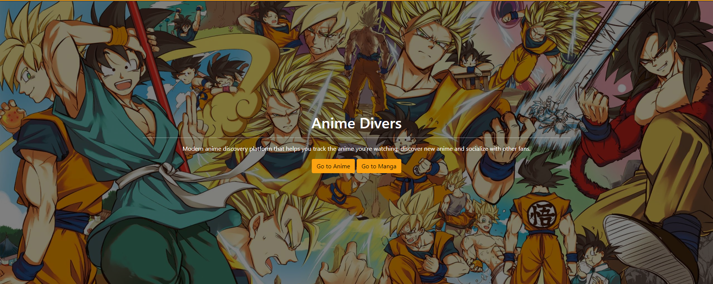
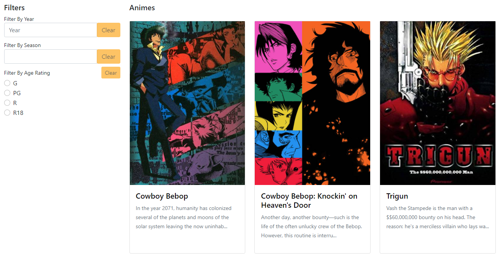
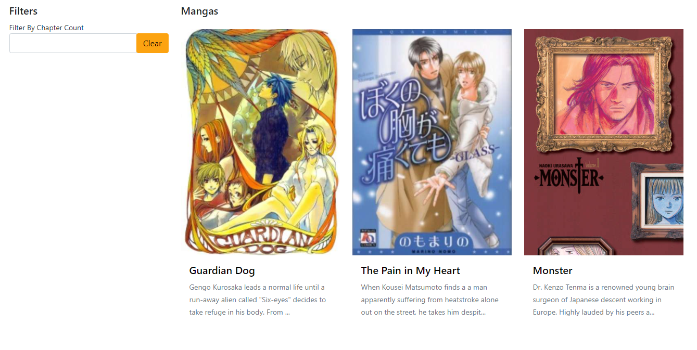
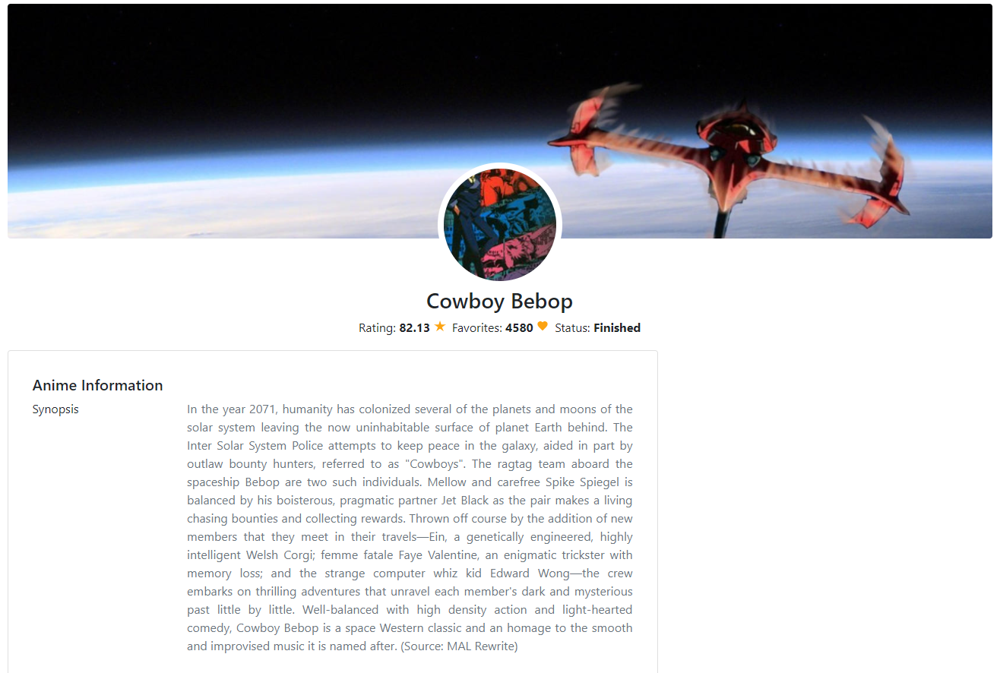
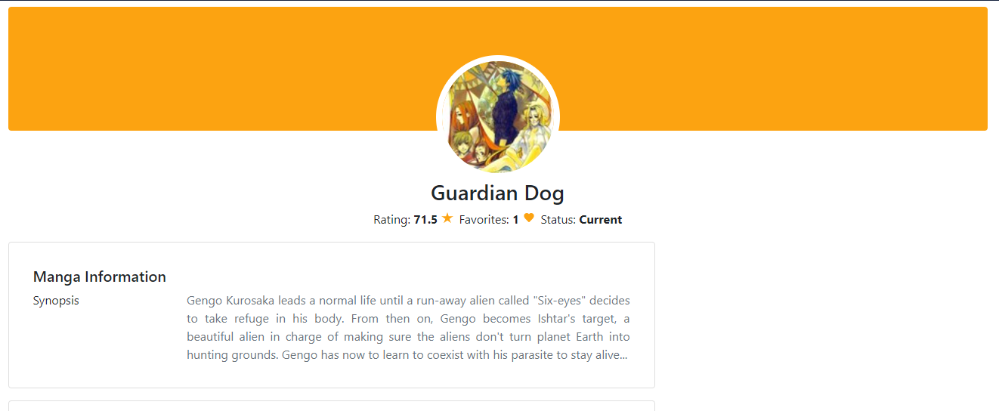

# Anime Divers

Consuming <a href="https://kitsu.docs.apiary.io/">Kitsu API</a> using React JS



## Features

- Getting Trending Anime and Manga
- Anime list, view and anime episodes
- Manga list, view and manga chapters
- Filters on Anime and Manga list

## Live Demo

Visit at [https://anime-divers.onrender.com](https://anime-divers.onrender.com)

## Installation

Requirements

- [NodeJS](https://nodejs.org/en/)
- [Git](https://git-scm.com/downloads)

Running it locally:
clone the repository

```
https://github.com/Dahnnyboi/Anime-Divers.git
```

rename .env-sample to .env file

```
nvm use
npm install
npm run start
```

## Sample Images





